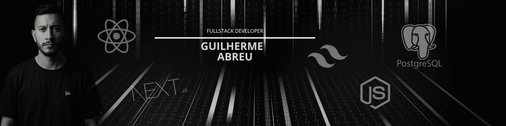

[+ao+Meu+Perfil!;Desenvolvedor+FullStack;Transformando+ideias+em+c%C3%B3digo!)](https://git.io/typing-svg)

     
 
<!-- Sobre mim -->
## Sobre mim :man_technologist:

Olá! sou Desenvolvedor FullStack, com foco na transformação de ideias em aplicações funcionais, bem estruturadas e orientadas à resolução de problemas reais.

Estou sempre buscando novos desafios e oportunidades de crescimento, me dedico a criar soluções eficientes e escaláveis. Acredito no poder do código limpo e bem estruturado para entregar produtos de alta qualidade.

Busco evoluir constantemente, ampliar minhas competências e contribuir para projetos que proporcionem desafios e aprendizado contínuo.

-  -Em constante evolução, buscando novos conhecimentos.
-  -Formado em Análise e Desenvolvimento de Sistemas.
-  -Desenvolvendo projetos pessoais para aprimorar conhecimentos e explorar novas tecnologias.
-  -Explorando e aprofundando conhecimentos em frameworks, bibliotecas e soluções de Inteligência Artificial.

**PORTIFOLIO** 
  
   [GA-DEVELOPEMENT](https://dev-abreeu.vercel.app/)

## Minhas Skills  
<!-- Front-End -->
**Front-end**
 

 

<!-- Back-End -->
**Back-End**
 

<!-- Ferramentas de desenvolvimento -->
**Ferramentas de desenvolvimento**
 

<!-- Github Status -->
<!--  

  <a href="https://github.com/Abreeu">
  
  

-->

 <!-- Contato -->
 
 
 <h2>Onde me encontrar </h2>
     
    
  
  
    

